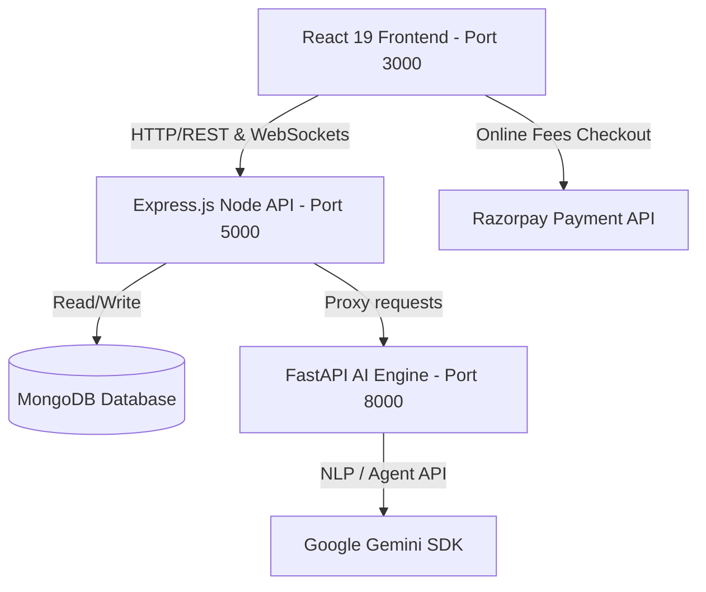

# EduFin Systems Architecture & API Specifications

EduFin is a modular, enterprise-grade AI-powered Smart Education Finance & Campus Management Ecosystem designed for universities.

## 1. System Architecture Overview

The platform uses a decoupled microservices design:



- **Frontend Client (Vite + React + TS)**: Styled using Tailwind CSS glassmorphism rules. Connects to Express for transactional requests and Socket.IO for alerts.
- **Backend API (Express.js + TypeScript)**: Houses business logic models, handles database transactions, and manages token-based authorization.
- **AI Engine (FastAPI + Python)**: Designed for machine learning workloads, receipt parsing OCR pipelines, and Generative AI (Google Gemini API).

---

## 2. Authentication & Security Flow

EduFin implements JWT authentication with **Refresh Token Rotation (RTR)** to secure API endpoints:

1. **User Login**: User submits email and password. Server verifies, generates an `AccessToken` (15-min lifespan) and a `RefreshToken` (7-day lifespan).
2. **Accessing Protected Routes**: The client includes the `AccessToken` in the HTTP header: `Authorization: Bearer <AccessToken>`.
3. **Session Refresh**: When the access token expires, the client calls `/api/auth/refresh` with the refresh token. The server rotates it: issues a *new* access/refresh token pair and invalidates the *old* refresh token.
4. **Reuse Detection**: If a compromised refresh token is re-submitted, the database revokes all active sessions for that user instantly.

---

## 3. Database Models Specification

The system specifies the following main MongoDB schemas:

- **Users**: Credentials, role tags (`SuperAdmin`, `Admin`, `Faculty`, `Parent`, `Student`), status, and active refresh token rotation arrays.
- **Students**: Academic enrollment keys, courses, departments, current semesters, and parent linking IDs.
- **Parents**: Parent-child relationship mappings and academic progress reports.
- **Faculty**: Designation, employee IDs, and assigned classroom subjects.
- **Attendance**: Date-course-student combinations for daily rolls.
- **Fee Collections**: Semester billing ledger (total invoices, balance dues, statuses).
- **Payments**: Razorpay signature audits, transaction IDs, payment methods, and timestamps.
- **Scholarships & Applications**: Rules, gpa criteria, income thresholds, and verification records.
- **Loans**: Co-applicant information, monthly EMI calculations, interest profiles, and status pipelines.
- **Expenses & Budgets**: Students' personal trackers, saving goals, and categories.
- **System Audit Logs**: Log entries tracking sensitive administrative events.

---

## 4. Primary API Endpoints Reference

### Authentication
- `POST /api/auth/login` - Submit credentials, returns tokens.
- `POST /api/auth/register` - Create user.
- `POST /api/auth/refresh` - Request token refresh (RTR).
- `POST /api/auth/logout` - Clear refresh tokens.
- `GET /api/auth/profile` - Fetch current profile.

### Dashboard Analytics
- `GET /api/dashboard` - Returns custom data payloads based on the user's authenticated role.

### Payment Processing
- `POST /api/payment/order` - Request Razorpay order ID.
- `POST /api/payment/verify` - Verify Razorpay signature and settle invoice ledger.
- `GET /api/payment/history` - Fetch payments history log.

### AI Engine (FastAPI integration)
- `POST /api/ai/chat` - Queries chat agent.
- `GET /api/ai/budget-advice` - Returns budget optimizations.
- `POST /api/ai/ocr-scan` - Extracts expense lines from invoice images.

---

## 5. Local Sandbox Run Instructions

### Prerequisites
- Node.js (v18+)
- MongoDB (running locally, or fallback mock triggers)
- Python (v3.10+, for AI service)

### Steps
1. **Database / Backend Server**:
   ```bash
   cd server
   npm install
   npm run dev
   ```
2. **Client Interface**:
   ```bash
   cd client
   npm install
   npm run dev
   ```
3. **AI Services**:
   ```bash
   cd ai-engine
   pip install -r requirements.txt
   uvicorn main:app --reload --port 8000
   ```
